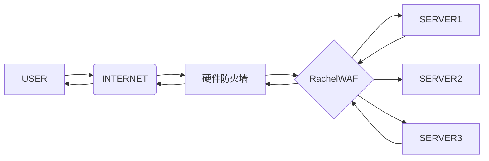

**强烈建议您在测试环境测试充分在上生产，如遇到问题请及时反馈**
# 软件介绍
RachelWAF防火墙是一款应用防火墙，完全私有化部署，数据加密且仅保存本地，一键启动，支持Linux，Windows 64位
- 支持私有化部署
- 轻量化不依赖三方服务
- 完全独立引擎，防护功能不依赖IIS,Nginx
- 自定义防护规则，支持脚本和界面编辑
- 支持白名单访问
- 支持IP黑名单
- 支持URL白名单
- 支持限制URL访问
- 支持指定界面数据隐私输出
- 支持CC频率访问
- 支持全局一键配置
- 支持分网站单独防护策略
- 日志加密保存
- 通讯日志加密
- 信息脱敏保存

## 启动访问
http://127.0.0.1:12306
默认帐号：rachel  默认密码：123654 (注意首次进入请把默认密码改掉)
